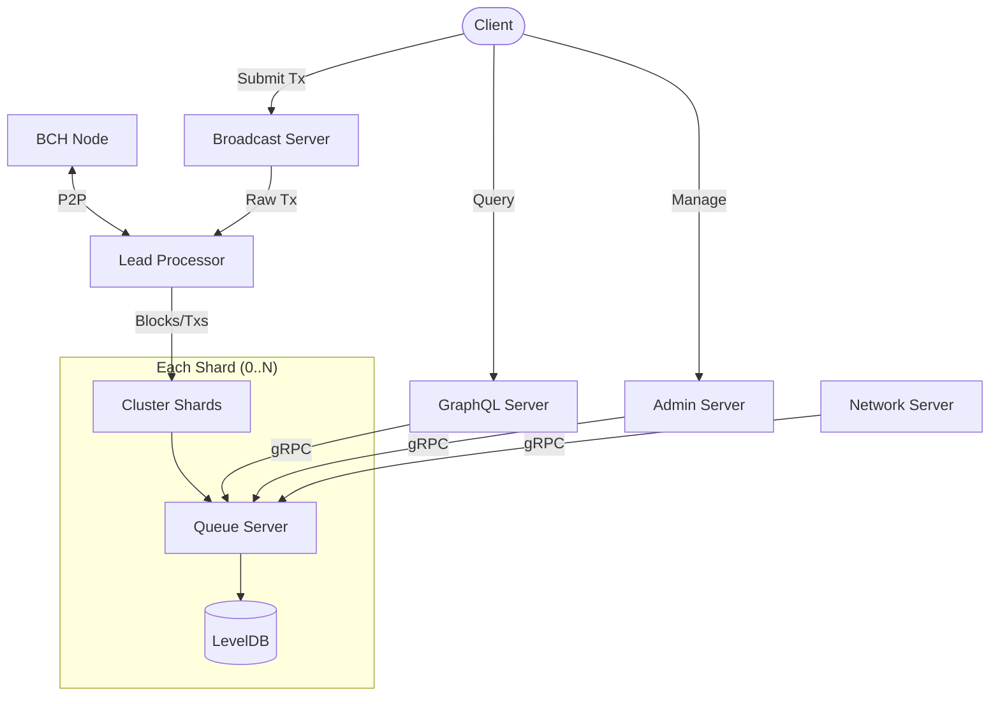

# Memo Index

### Install Go

https://go.dev/doc/install

### Checkout repo and run server
```sh
git clone git@github.com:memocash/index.git
cd index
go build
./index serve live
```

## Architecture



## Configuration

Two options for setting config values.

1. Use environment variables, e.g.
    ```sh
    NODE_HOST=example.com:8333 ./index serve live
    ```
2. Use a config file, e.g. `config.yaml`:
    ```yaml
    NODE_HOST: example.com:8333
    GRAPHQL_PORT: 8080
    ```
